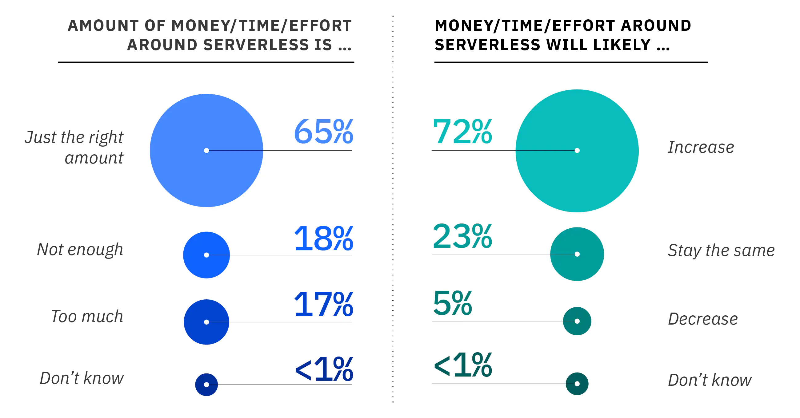

# **Serverless**

## **What is Serverless?**

**Serverless is a cloud application development and execution model that lets developers build and run code without managing servers, and without paying for idle cloud infrastructure.** [1]

> Important: With serverless, developers never pay for idle capacity. The cloud provider spins up and provisions the required computing resources on demand when the code executes, and spins them back down again—called ‘scaling to zero’—when execution stops. The billing starts when execution starts, and ends when execution stops; typically, pricing is based on execution time and resources required.

## Serverless does not mean 'no servers'
The name notwithstanding, there are most definitely servers in serverless computing. 'Serverless' describes the developer’s experience with those servers—they are are invisible to the developer, who doesn't see them, manage them, or interact with them in any way. [1]

Together serverless computing, [microservices](https://www.ibm.com/cloud/learn/microservices) and [containers](https://www.ibm.com/cloud/learn/containers) form a triumvirate of technologies typically considered to be at the core of cloud-native application development.

 

**_Figure 1: Organizations will continue to invest in serverless._** _95 percent of users surveyed plan to maintain or increase their serverless investments during the next year._ [2]

## Terminology

### **Big O**
- The **Big O time complexity for 
- **The Big O space complexity for 

**For more on the subject of _Serverless & Cloud Computing_, refer to the following article titled *`What is Serverless?`* at `ibm.com`**
 - [Implementation: Serverless](https://www.ibm.com/cloud/learn/serverless)
 

> **Function-as-a-service**, or **_FaaS_**, is a cloud computing service that enables developers to run code or containers in response to specific events or requests, without specifying or managing the infrastructure required to run to code. [1]

## **Pros and cons of serverless**

### Pros

- **Improved developer productivity:** As noted above, serverless enables development teams to focus on writing code, not managing infrastructure. It gives developers much more time to innovate and optimize their front-end application functionality and business logic.

- **Pay for execution only:** The meter starts when the request is made, and ends when execution finishes. Compare this to the infrastructure as a service (IaaS) compute model, where customers pay for the physical servers, virtual machines (VMs) and other resources required to run applications, from the time they provision those resources until the time they explicitly decommission them.

- **Develop in any language:** Serverless is a polyglot environment, enabling developers to code in any language or framework—Java, Python, JavaScript, node.js—with which they're comfortable.

- **Streamlined development/DevOps cycles**. Serverless simplifies deployment and, in a larger sense, simplifies DevOps because developers don't spend time defining infrastructure required to integrate, test, deliver and deploy code builds into production.

- **Cost-effective performance.** For certain workloads—embarrassingly parallel processing, stream processing, certain data processing tasks—serverless computing can be both faster and more cost-effective than other forms of compute.

- **Usage visibility.** Serverless platforms provide near-total visibility into system and user times and can aggregate usage information systematically.

### Cons

- **Unacceptable latency for certain applications:** Because serverless architectures forgo ongoing processes in favor of scaling up and down to zero, they also sometimes need to start up from zero to serve a new request. For many applications the resultant delay would not be detrimental or even noticeable to users. But for others—say, a financial trading application—this cold-start latency might be unacceptable.

- **Higher costs for stable or predictable workloads:** Because serverless scales up and down on demand in response to workload, it offers significant cost savings for spiky workloads. But it does not offer the same savings for workloads characterized by predictable, steady or long-running processes; in these cases, a traditional server environment might be simpler and more cost-effective.

- **Monitoring and debugging issues:** These operational tasks are challenging in any distributed system, but serverless architecture (or microservices architecture, or a combination of the two) only exacerbates the complexity. For example, teams may find it difficult or impossible to monitor or debug serverless functions using existing tools or processes.

- **Vendor lock-in:** As noted, one of the biggest advantages of serverless is that the cloud provider manages all the computing resources. While this frees up considerable time for developers to focus on writing and improving their code, it also means that migrating code to a new cloud provider could prove challenging. Many cloud provider’s serverless platforms are designed to provide an ecosystem of managed cloud services and are not portable like virtual machines (VMs) or Docker containers. Application code that triggers several services offered by one cloud provider’s serverless platform might have to be partially or completely rewritten to get get the same results in another provider’s platform.

 

## I want to learn more about
 - Serverless.
 - Cloud Computing.
 

[1]: https://www.ibm.com/cloud/learn/serverless
[2]: https://www.ibm.com/downloads/cas/ZJLWQOAQ