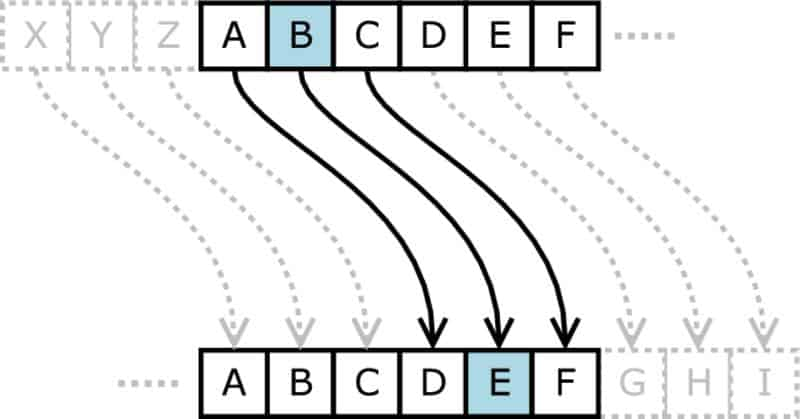

# **Encryption, Decryption, And Cracking**

**Cryptography**, or _the art and science of encrypting sensitive information_, was once exclusive to the realms of government, academia, and the military. However, with recent technological advancements, cryptography has begun to permeate all facets of everyday life. [3]

Unfortunately, due to the inherent complexities of cryptography, many people assume that this is a topic better left to black hat hackers, multi-billion dollar conglomerates, and the NSA.
But nothing could be further from the truth.

With the vast amounts of personal data circulating the Internet, it is more important now than ever before to learn how to successfully protect yourself from individuals with ill intentions.

## **What are the three key aspects of data encryption?**

1. Encryption: scrambling the data according to a secret key.
2. Decryption: recovering the original data from scrambled data by using the secret key.
3. Code cracking: uncovering the original data without knowing the secret, by using a variety of clever techniques.

## **Types of Cryptography**
1. Hashing
2. Symmetric Cryptography
3. Asymmetric Cryptography
4. Key Exchange Algorithms

## The Caesar Cipher

>The Caesar Cipher is a simple substitution cipher which replaces each original letter with a different letter in the alphabet by shifting the alphabet by a certain amount. [1]

## Decrypting a message

To decrypt / decipher an encoded message, it is necessary to know the encryption used (or the encoding method, or the implemented cryptographic principle). Without knowing the technique chosen by the sender of the message, it is impossible to decrypt it (or decode it). [2]

## Cracking the cipher

There are three main techniques one could use to "crack" a cipher without knowing how its encryption works (amount of shift in a ceasar cipher):
- Frequency analysis.
- Known plaintext.
- And brute force.

### Frequency analysis
Human languages tend to use some letters more than others. For example, "E" is the most popular letter in the English language. We can analyze the frequency of the characters in the message and identify the most likely "E" and narrow down the possible shift amounts based on that. [1]

### Known plaintext
Another term for the original unencrypted message is plaintext. If one already knew some part of the plaintext, it will be easier for them to crack the rest of the encrypted version. [1]

### Brute force
There are only 25 possible shifts. One could take some time to try out each of them and find one that yielded a sensible message. They wouldn't even need to try the shifts on the entire message, just the first word or two.

 

## I want to learn more about
 - Encryption.
 - Decryption.
 - Cracking.
 - Ethical Hacking.
 

[1]: https://www.khanacademy.org/computing/computers-and-internet/xcae6f4a7ff015e7d:online-data-security/xcae6f4a7ff015e7d:data-encryption-techniques/a/encryption-decryption-and-code-cracking

[2]: https://www.dcode.fr/cipher-identifier#:~:text=To%20decrypt%20%2F%20decipher%20an%20encoded,it%20(or%20decode%20it).

[3]: https://thebestvpn.com/cryptography/
