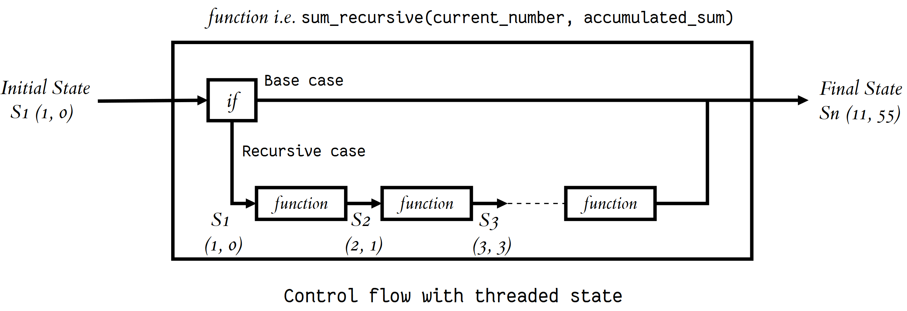
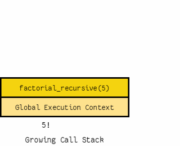

# **Classes and Objects**

> **Objects** are *an encapsulation of variables and functions into a single entity*. Objects get their variables and functions from classes. **Classes** are *essentially a template to create your objects.* [1]

## Accessing Object Variables
This is done by treating the variable as an 'attribute' of the object; following the syntax **`Object.variable`**

## Accessing Object Functions
This is by no means very different from the previous concept, the syntax looks something like **`Object.function()`**

## init()
The **`__init__()`** function, is a special function that is called when the class is being initiated. It's used for asigning values in a class. [1]

 

# **Recursive Functions in Python**

### **A recursive function** is *a function defined in terms of itself via self-referential expressions.* [2]

 

> All recursive functions share a common structure made up of two parts: base case and recursive case. [2]

 

## Maintaining State

In order to maintain state during recursion you have to either:

- Thread the state through each recursive call so that the current state is part of the current call’s execution context.
- Keep the state in global scope.

Note that ***threading*** a state through each recursive call means *passing the updated current state to each recursive call as arguments*

 

## Recursive Data Structures in Python

> A data structure is recursive if it can be defined in terms of a smaller version of itself. [2]

### *Mind the stacks : )*

Python doesn’t have support for tail-call elimination. As a result, we can cause a stack overflow if we end up using more stack frames than the default call stack depth:
 
        import sys
        sys.getrecursionlimit()

-

 

## Things I want to know more about
- The *`__init__()`* function.
- Using **regular expressions** inside a function to deal with user input while creating customized objects based on them.
- The **`@`** symbol and its uses in Python; such as `@lru_cache(maxsize=None)`.
- Python Decorators.

[1]: https://www.learnpython.org/en/Classes_and_Objects
[2]: https://realpython.com/python-thinking-recursively/