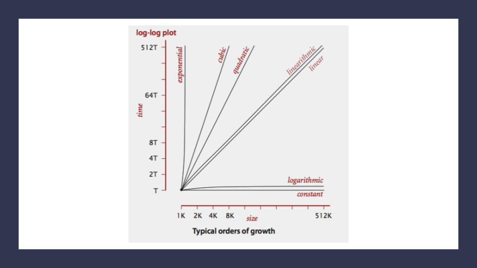

# **More About _Big O:_ Analysis of Algorithm Efficiency**

### **Big O** notation is used to _describe the efficiency of an algorithm or function_. This is evaluated based on 2 factors:

1. Running Time (aka time efficiency / complexity)

2. Memory Space (aka known as space efficiency / complexity)

> Big O’s role in algorithm efficiency is to describe the Worst Case of efficiency an algorithm can have in performing it’s job. [1]

## To analyze the aforementioned limiting factors, 4 Key Areas are  considered for analysis as follows:

### 1. Input Size
_Denoted as **n**_, input Size refers to the size of the parameter values that are read by the algorithm.

### 2. Units of Measurement
**Three Measurements of time:**

- The time in milliseconds, from the start of a function execution until it ends.
- The number of operations that are executed.
- The number of “Basic Operations” that are executed.

> Basic Operation” refers to the operation that is contributing the most to the total running time. This is usually the most time consuming operation within the inner most loop.

**from the start of a function execution until it ends;** *i.e. The amount of space needed..*

- To hold the code for the algorithm.
- To hold the input data.
- To hold the input data.
- To hold working space during the calculation.
    - *Working Space can be thought of as the creation of variables and reference points as our function performs calculations. This will also include Stack Space of recursive function calls … specifically how memory usage scales relatively with the size of the input.* [1]

    ***`Space Complexity and Time Complexity are measured differently and should be analyzed separately.`***

### 3. Orders of Growth

Notes:
- The fibonacci sequence is a popular case for exponential complexity growth.
- Quadratic Complexity is often seen in algorithms that have nested loops which perform iterative or recursive logic on all values of n and immediately iterate or recurse again for each value of n.

### 4. Best Case, Worst Case, and Average Case

- Worst Case **`Big O(oh)`**: The efficiency for the worst possible input of size n.
- Best Case **`Big Omega`**: The efficiency for the best possible input of size n
- Average Case **`Big Theta`**: The efficiency for a “typical” or “random” input of size n.
    - *The average case makes a typical assumption about the possible inputs of size ‘n’ and how they might affect efficiency. This is NOT the best case and worst case averaged together.* [1]

## Overall..

 

# **Linked Lists**

A ***Linked List*** is a sequence of `Nodes` that are connected/linked to each other. 
There are two types of Linked List - ***Singly*** and **Doubly**.

## Terminology
- **Linked List** - A `data structure` that contains nodes that links/points to the next node in the list.
- **Singly** - A *Singly linked list* means that there is only one reference, and the reference points to the Next node in a linked list.
- **Doubly** - Doubly refers to there being two (double) references within the node. A Doubly linked list means that there is a reference to both the Next and Previous node.
- **Node** - Nodes are the individual items/links that live in a linked list.
- **Next** - Each node contains a property called Next. This property contains the reference to the next node.
- **Next** - Each node contains a property called Next. This property contains the reference to the next node.
- **Current** - The Current is a reference of type `Node` to the node that is currently being looked at. [2]

**For more on the subject of _Linked Lists_, refer to the following articles titled *'What’s a Linked List, Anyway?'* at `medium.com`**
 - [Part1](https://medium.com/basecs/whats-a-linked-list-anyway-part-1-d8b7e6508b9d)
 - [Part2](https://medium.com/basecs/whats-a-linked-list-anyway-part-2-131d96f71996)

## I want to learn more about
 - Traversal
 - Adding Nodes
 

[1]: https://codefellows.github.io/common_curriculum/data_structures_and_algorithms/Code_401/class-05/resources/big_oh.html
[2]: https://codefellows.github.io/common_curriculum/data_structures_and_algorithms/Code_401/class-05/resources/singly_linked_list.html