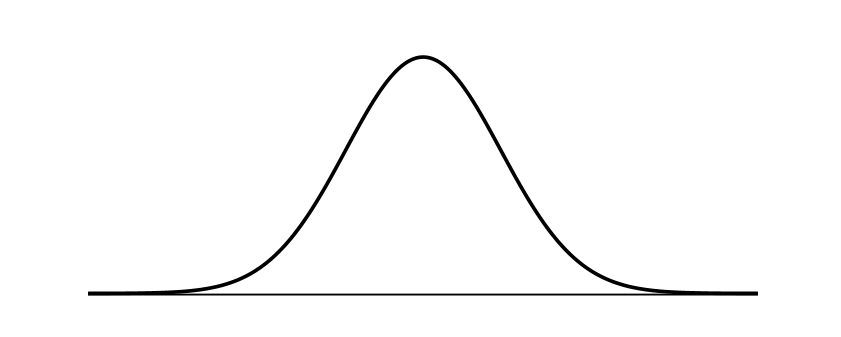

# Ten Thousand Game 4

## **Special Methods** (aka Magic / Dunder Methods)

In Python, special methods are a set of predefined methods you can use to enrich classes.

Because these methods start and end with double underscores, for example `__init__` or `__str__`, the term *dunder* is used as short form of “_double under_”. [1]

Dunder methods let one emulate the behavior of built-in types.

The dunder convention is a namespace *reserved* for the **core Python team** to implement their own protocols. **Never** use the namespace for your own, library-specific things! *This defeats the whole purpose*. If you need to hide a property, use `_attribute` or `__attribute`. [2]

## Rules one should follow for dunders: [2]

1. **Call them “dunders”** — Terminology like “magic” makes them seem much more complicated than they actually are. For example, _it’s the “dunder call method”_, not the “double-underscore call double-underscore method” and not the “magic call method”.

2. **Implement dunders on your classes at will** — _There is nothing magic about them_, you shouldn’t feel like you’re using an esoteric language feature when you implement the __call__ method. Because, you’re not! It’s a standard language feature just like __init__!

3. **Never, ever, invent your own dunders** — Python leaves you with a number of clean namespaces (classes, modules, etc.) for your own code. Use them! The core Python team reserved a somewhat ugly namespace for themselves — don’t trample all over their compromise by stealing their names.

> You can see _Python’s data model as a powerful API_ you can interface with by implementing one or more dunder methods. If you want to write _more Pythonic code_, knowing how and when to use dunder methods is an important step. [1]

## Enriching a Simple Class

### Using dunder methods, a simple class can be enriched to have the following features:

- Initialization of new objects (i.e. `__init__`)

- Object representation (i.e. `__str__`, `__repr__`)

- Enable iteration (i.e. `__len__`, `__getitem__`, `__reversed__`)

- Operator overloading (comparison) (i.e. `__eq__`, `__lt__`)

- Operator overloading (addition) (i.e. `__add__`)

- Method invocation (i.e. `__call__`)

- Context manager support (with statement) (i.e. `__enter__`, `__exit__`)

### Why Every Python Class Needs a __repr__
If you don’t add a __str__ method, Python falls back on the result of __repr__ when looking for __str__. Therefore, I recommend that you always add at least a __repr__ method to your classes. This will guarantee a useful string conversion result in almost all cases, with a minimum of implementation work. [3]

### Here’s how to add basic string conversion support to our classes quickly and efficiently. [3]

    `def __repr__(self):
       > return (f'{self.__class__.__name__}('
               f'{self.attribute_1!r}, {self.attribute_2!r})')`

**Please note that we're using the `!r` `conversion flag` to make sure the output string uses _`repr(self.attribute_1)`_ and _`repr(self.attribute_2)`_ instead of** _str(self.attribute_1)_ **and** _str(self.attribute_2)_.

Also, the *benefit of using th `__class__.__name__`is we won’t have to modify the `__repr__` implementation when the class name changes.* This makes it easy to adhere to the Don’t Repeat Yourself (DRY) principle:

_For more on the subject of **Dunder Methods** check this [**GREAT** Article](https://dbader.org/blog/python-dunder-methods) By Bob Belderbos on dbader.org_

# Basic Statistics in Python — Probability

## What is probability

At the most basic level, **probability** seeks to answer the question, “What is the chance of an event happening?”

- An **event** is some outcome of interest.
- The **sample space** is the set of all possible events that can happen.
- To **calculate the probability** of an event occurring, we _count_ how many times are event of interest can occur and _divide_ it by the sample space.
- We can use statistics to calculate probabilities based on observations from the real world and check how it compares to the ideal.
- A **trial** is a single performance of well-defined experiment.
- One trial is only one _data point_. 
- As we get _more_ trials, the _deviation_ away from the average _decreases_.

### Check this quoted **beautiful** code to calculate the probability of getting heads from a simulated practical trial of flipping a coin `n` times using the `random` module. [4]

    import random
    def coin_trial():
    heads = 0
    for i in range(100):
        if random.random() <= 0.5:
            heads +=1
        return heads
    def simulate(n):
        trials = []
        for i in range(n):
            trials.append(coin_trial())
        return(sum(trials)/n)

    simulate(10) -> 5.4
    simulate(100) -> 4.83
    simulate(1000) -> 5.055
    simulate(1000000) -> 4.999781

## The Normal Distribution

_In probability, the normal distribution is a particular distribution of the probability across all of the events._ [4]

- The normal distribution refers to a particularly important phenomenon in the realm of probability and statistics.

- The most important qualities to notice about the normal distribution is its **symmetry** and its **shape**.

### The normal distribution is significant to probability and statistics thanks to two factors: the **Central Limit Theorem** and the **Three Sigma Rule**.

### Z-score

- The Z-score is a simple calculation that answers the question, “Given a data point, how many standard deviations is it away from the mean?”

- By itself, the Z-score doesn’t provide much information to you. It gains the most value when compared against a Z-table, which tabulates the cumulative probability of a standard normal distribution up until a given Z-score. 

## Things I want to know more about:
1. The Random Module.
2. Python's Data Model.
3. REPL.

[1]: https://dbader.org/blog/python-dunder-methods

[2]: http://www.pixelmonkey.org/2013/04/11/python-double-under-double-wonder

[3]: https://dbader.org/blog/python-repr-vs-str

[4]: https://www.dataquest.io/blog/basic-statistics-in-python-probability/